# Open Game System 🎮

Adding native capabilities to web games through open protocols and standards. ✨

Open Game System is an open-source initiative that enables web games to access native mobile capabilities through standardized protocols. 📱 We're building a cross-platform ecosystem that bridges the gap between web and native experiences, allowing developers to add authentication, push notifications, and TV casting to their games without complex native implementations.

[](https://opengame.org)
[](mailto:hello@opengame.org)
[](https://x.com/OpenGameCo)
[](https://discord.gg/n8TWakM7k8)

The Open Game System (OGS) provides protocols, SDKs, and services that let web-based games leverage native mobile capabilities like push notifications and Chromecast integration. 🔌 Our ecosystem is designed to be web-first, protocol-based, and platform-independent, enabling game developers to maintain their own identity while accessing powerful native features.

Our repositories contain:
- 📋 Protocol specifications for account linking, push notifications, and TV casting
- 💻 Client SDKs that implement these protocols with minimal code
- ⚙️ Server implementations powering the ecosystem
- 📱 A mobile companion app that bridges web games with native features

Whether you're building a casual web game or a complex multiplayer experience, OGS helps you extend your reach across platforms while staying web-first. 🚀

## Key Features

- 🌐 **Web-First Architecture**: Everything is designed for games that live primarily on the web
- 🔄 **Protocol-Based Approach**: Clear communication protocols between web games and native capabilities
- 🔐 **Independent Identity**: Games maintain their own authentication and user management
- 📱 **Cross-Platform Support**: Works across browsers, iOS, Android, and smart TVs
- 📦 **TypeScript SDKs**: Well-documented TypeScript libraries with React components
- **Native Capabilities** 🔔: Push notifications, TV casting, and more
- **Developer-First** 💻: Simple SDKs with clear, consistent patterns
- **Independent Integration** 🧩: Use only the components you need

## Components

### SDKs 🧰

Our SDKs follow a headless pattern that separates state from UI, giving developers complete control over presentation while handling complex system interactions:

- 🔐 **[auth-kit](https://github.com/open-game-system/auth-kit)**: A lightweight SDK implementing the Account Linking Protocol
- 🔔 **[notification-kit](https://github.com/open-game-system/notification-kit)**: Implements the Push Notification Protocol for iOS, Android, and web
- 📺 **[cast-kit](https://github.com/open-game-system/cast-kit)**: TypeScript library implementing the TV Casting Protocol
- 🌉 **[store-bridge](https://github.com/open-game-system/store-bridge)**: A bridge that connects web games and the OpenGame App through a shared state store

### Platform Components 📱🌐

- 📱 **[opengame-app](https://github.com/open-game-system/opengame-app)**: The official mobile application for OGS
- 🌐 **[opengame-org](https://github.com/open-game-system/opengame-org)**: The official website and platform for the OGS ecosystem
- ⚙️ **[opengame-api](https://github.com/open-game-system/opengame-api)**: The backend API service powering the OGS ecosystem

### Reference Implementation ⭐

- 🎮 **[trivia-jam](https://github.com/open-game-system/trivia-jam)**: A reference implementation showcasing Cast Kit integration

## Specification

The [OGS Specification](https://github.com/open-game-system/specification) defines the protocols and requirements for integrating with the Open Game System. The specification covers:

- Account Linking Protocol
- Push Notification Protocol
- TV Casting Protocol

For detailed technical requirements, refer to the [specification repository](https://github.com/open-game-system/specification).

## Architecture Overview

The Open Game System uses a WebView-based architecture that enables web games to access native capabilities. Our approach is simple: your web game code loads inside the OGS App's WebView when enhanced features are needed, but that same code can also run in a regular browser with appropriate fallbacks.

```mermaid
graph TD
    subgraph "Your Web Game"
        A[Web Game Code] --- B[OGS SDKs]
        B --- C1[Auth Kit]
        B --- C2[Notification Kit] 
        B --- C3[Cast Kit]
    end
    
    subgraph "Environments"
        D1[Regular Browser] -.-> A
        
        subgraph "OGS App"
            D2[WebView Container] -.-> A
            D2 --- E[JavaScript Bridge]
            E --- F[Native Features]
            F --- G1[Push Notifications]
            F --- G2[TV Casting]
            F --- G3[Authentication]
        end
    end
    
    B <-->|postMessage| E
    
    style A fill:#f9f,stroke:#333,stroke-width:2px
    style D2 fill:#bbf,stroke:#333,stroke-width:2px
    style E fill:#bbf,stroke:#333,stroke-width:2px
```



Similar to how Expo Go works, the OGS App provides a pre-built container where your web game can run and access native features. Each SDK communicates across the JavaScript bridge (using postMessage) to call corresponding native implementations. Your game code remains the same whether it's running in a browser or the OGS App container.

### How It Works


### Progressive Enhancement


This approach is similar to how web-based container apps work:
1. Write your game once using web technologies
2. Integrate OGS SDKs that communicate through the WebView bridge
3. Your game runs in browsers with appropriate fallbacks
4. The same code runs in the OGS App WebView with access to native features
5. Optionally create your own native app shell with a WebView if needed

### Example: Cast Kit Integration

Cast Kit transforms phones into controllers and TVs into displays, enabling immersive gameplay experiences on larger screens:


### Code Example: Using Cast Kit

Here's a simplified example of how to integrate Cast Kit into your game using the context provider pattern:

```jsx
import { createCastKitContext } from '@open-game-system/cast-kit/react';
import { useState, useEffect } from 'react';

// Create the context once at the top level
const CastKit = createCastKitContext();

// Root component with provider
function GameRoot() {
  return (
    <CastKit.Provider>
      <Game />
    </CastKit.Provider>
  );
}

// Game component using the context
function Game() {
  const [gameState, setGameState] = useState({
    score: 0,
    level: 1,
    players: []
  });
  
  // Signal ready on mount
  useEffect(() => {
    // Initialize with game information
    CastKit.signalReady({
      gameId: 'game-123',
      roomCode: 'ABC123',
      broadcastUrl: `https://yourgame.com/tv?gameId=game-123&roomCode=ABC123`
    });
  }, []);
  
  // Update game state
  const addPoint = () => {
    setGameState(prev => ({
      ...prev,
      score: prev.score + 1
    }));
  };
  
  return (
    <div className="game-container">
      {/* Top navigation with cast button */}
      <header className="game-header">
        <h1>Game Title</h1>
        <CastKit.Button /> {/* Pre-styled button with status */}
      </header>
      
      {/* Game content changes based on casting state */}
      <main>
        <CastKit.When casting={false}>
          {/* Regular game UI shown when not casting */}
          <div className="game-view">
            <h2>Game View</h2>
            <p>Score: {gameState.score}</p>
            <p>Level: {gameState.level}</p>
            <button onClick={addPoint}>Add Point</button>
          </div>
        </CastKit.When>
        
        <CastKit.When casting={true}>
          {/* Controller UI shown when casting to TV */}
          <div className="controller-view">
            <h2>Controller Mode</h2>
            <p>You're casting to: <CastKit.DeviceName /></p>
            <button onClick={addPoint} className="large-button">
              Add Point
            </button>
          </div>
        </CastKit.When>
      </main>
    </div>
  );
}
```

When this code runs in the OGS App:
- The CastKit context automatically detects it's running in the OGS App and connects to the native Chromecast SDK
- The `<CastKit.Button />` component provides device selection and casting controls
- Conditional rendering with `<CastKit.When>` switches between game view and controller view
- Game state updates are automatically sent to the TV in real-time

When the same code runs in a regular browser:
- The context detects it's not in the OGS App and provides appropriate fallbacks
- The cast button shows a QR code or download link for the OGS App
- The game remains fully playable in the browser

## Getting Started

1. Choose which features you need (authentication, notifications, casting)
2. Install the relevant SDK packages
3. Follow the integration guides in each SDK repository

Each kit provides detailed documentation with examples to get you started quickly.

## Community & Support

- **Website**: [opengame.org](https://opengame.org)
- **Email**: [hello@opengame.org](mailto:hello@opengame.org)
- **GitHub Discussions**: [Join the conversation](https://github.com/orgs/open-game-system/discussions)

## License

Our SDKs and specifications are available under the MIT License.